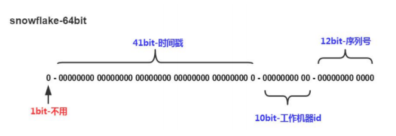

## 分布式ID生成器 
由于我们的数据库在生产环境中要分片部署（MyCat）,所以我们不能使用数据库本 身的自增功能来产生主键值，只能由程序来生成唯一的主键值。我们采用的是开源的 twitter( 非官方中文惯称：推特.是国外的一个网站，是一个社交网络及微博客服务) 的 snowflake （雪花）算法。

默认情况下41bit的时间戳可以支持该算法使用到2082年，10bit的工作机器id可以 支持1024台机器，序列号支持1毫秒产生4096个自增序列id . SnowFlake的优点是，整 体上按照时间自增排序，并且整个分布式系统内不会产生ID碰撞(由数据中心ID和机器ID 作区分)，并且效率较高，经测试，SnowFlake每秒能够产生26万ID左右

## MongoDB
吐槽和评论两项功能存在以下特点： 
1. 数据量大 
2. 写入操作频繁 
3. 价值较低 

对于这样的数据，我们更适合使用MongoDB来实现数据的存储

MongoDB 是一个跨平台的，面向文档的数据库，是当前 NoSQL 数据库产品中最热 门的一种。它介于关系数据库和非关系数据库之间，是非关系数据库当中功能最丰富，最 像关系数据库的产品。它支持的数据结构非常松散，是类似 JSON 的 BSON 格式，因此可以 存储比较复杂的数据类型。 

MongoDB 的官方网站地址是：http://www.mongodb.org/

## MongoDB特点 
MongoDB 最大的特点是他支持的查询语言非常强大，其语法有点类似于面向对象 的查询语言，几乎可以实现类似关系数据库单表查询的绝大部分功能，而且还支持对数据建 立索引。它是一个面向集合的,模式自由的文档型数据库。 

具体特点总结如下： （1）面向集合存储，易于存储对象类型的数据 （2）模式自由 （3）支持动态查询 （4）支持完全索引，包含内部对象 （5）支持复制和故障恢复 （6）使用高效的二进制数据存储，包括大型对象（如视频等） （7）自动处理碎片，以支持云计算层次的扩展性 （8）支持 Python，PHP，Ruby，Java，C，C#，Javascript，Perl 及 C++语言的驱动程 序，社区中也提供了对 Erlang 及.NET 等平台的驱动程序 （9） 文件存储格式为 BSON（一种 JSON 的扩展）